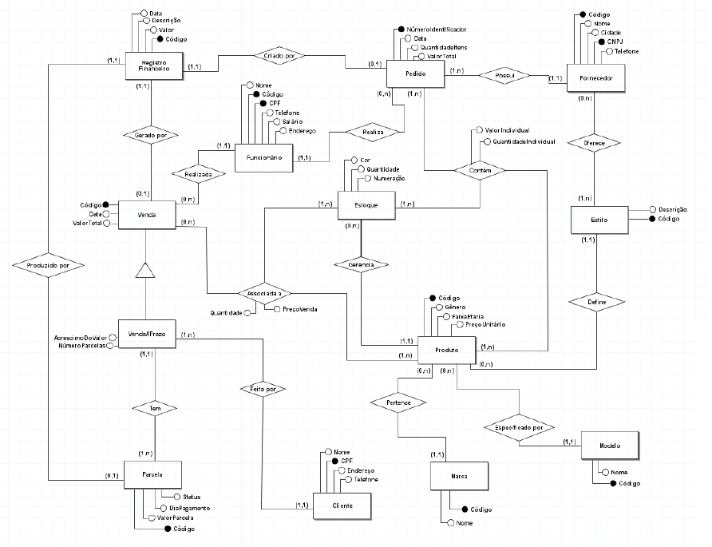

# Projeto Loja de Calçados

## Projeto para disciplina de Desenvolvimento de Aplicações Corporativas 2024.1

Grupo: 

- [Gabriella](https://github.com/gabs44)
- [Marianna](https://github.com/MariLopes1223)
- [Maria Clara](https://github.com/marysclair)
- [Maurício](https://github.com/maueici0)
- [Veríssimo](https://github.com/verissimon)

## Descrição do projeto

Este projeto elabora o sistema proposto para a gerência eficiente de uma loja de calçados. Ele permitirá que os usuários armazenem e
acessem informações sobre os produtos da loja, estoque, clientes, vendas e outros dados
relevantes.

## Diagrama Entidade Relacionamento

A imagem a seguir apresenta todas as tabelas e relacionamentos presentes na aplicação.



# Executando

Ao fazer o clone do repositório, abra o terminal no diretório do projeto e execute os comandos linha por linha.

```bash
docker compose up 
./mvnw clean
./mvnw install
./mvnw spring-boot:run
```

# Resolução de problemas
- Pode ser que o comando do docker seja `docker-compose` (com hífen) na sua máquina. Faça o ajuste de acordo;
- Pode ser que você tenha o PostgreSQL instalado na sua máquina. Se for esse o caso, altere o arquivo `docker-compose.yml`, substituindo o mapeamento da porta na linha 11 por outra porta além da `5432`. Exemplo utilizando a porta 5433: `5433:5432`. No caso de alterar essa porta, altere a URL de conexão no arquivo `application.properties`;
- Em caso do erro "No compiler is provided in this environment" ao executar os comandos `mvnw`, verifique se a variável JAVA_HOME está definida no seu ambiente. Caso não esteja, siga [esse tutorial](https://www.baeldung.com/java-home-on-windows-mac-os-x-linux)

